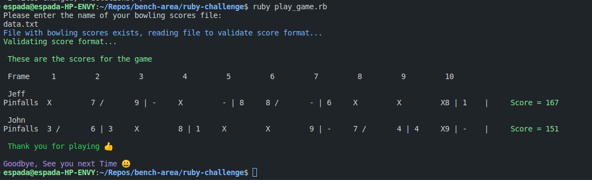

# A bowling score calculator

> This repo hosts a Ruby application for scoring a bowling game from data provided in a text file.

## Preview

## Built With

- **Ruby**

## Methodology used 
- TDD via RSPEC
  
## Getting Started
To get a local copy up and running follow these simple example steps.

## Prerequisites

- You need Ruby v3+ installed on your machine.

## Setup
- Clone the project `https://git.jobsity.com/benkiarie/ruby-challenge.git`
- navigate to the folder `cd ruby-challenge`
- Install required gems `bundle install`

## File Structure 
- The `root` folder contains the `play_game.rb` file which is entry point to the application.
- The `lib` folder contains the `main.rb` file which is the main class for the application. 
- The `main.rb` file contains the `FileReader` module which reads and validates the input and the `Bowling` module which is responsible for the game logic.

## Usage
- Run the application `ruby play_game.rb` which will prompt you to enter the file path of the game data file.
- For the purpose of this challenge, the game data file is located in the `root` folder. Therefore, you can enter `data.txt` as the file path.
- Enjoy interacting with the app.

## Author

👤 **Ben Kiarie**

- GitHub: [Ben Kiarie](https://github.com/Benmuiruri) - Follow me on Github, browse my projects, and leave a star for any project you like.
  
